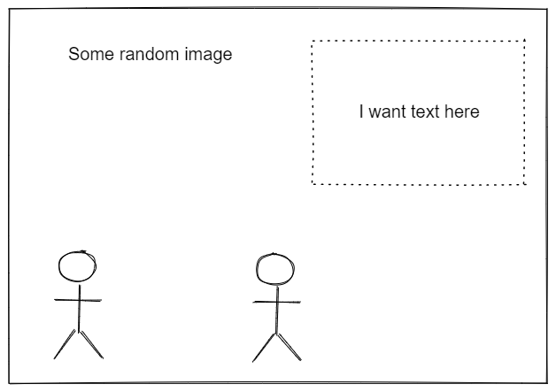
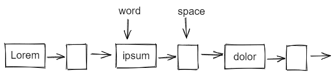
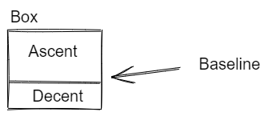
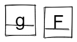
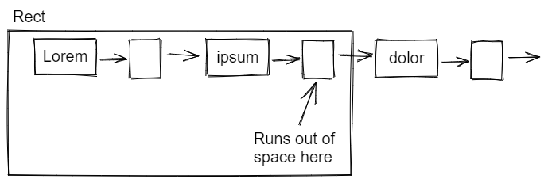

# golang-wrapper

This is a library to provide positional and rendering word wrapping of text any arbitrary rectangle. 
It is capable of giving you the positions of each individual word, as well as rendering it to an image if desired.



To


It is technically capable of handling rich text and non-text objects; adding them can be done manually as a library user.

Part of the goal of the library was to:
* Provide just positioning details without drawing
* Be as simple as necessary
* Be usable with the `image` package and not provide too much of a framework
* Support rich text eventually
* Support arbitrary locations provided as a `image.Rectangle` or `image.Image`

# Concept

## Box



The basics of the library is that it first breaks up the line in to "boxes" boxes can essentially be anything however
in the 'simple' implementation here they are assumed to be a set of characters, spaces, or a control character (essentially
a new line) A box can be thought of the lowest level representation that the library is willing to dea with.

This is created by a `boxer` a standard iterator like component:
```go
type Boxer interface {
    Next() (Box, int, error)
    SetFontDrawer(face *font.Drawer)
    FontDrawer() *font.Drawer
    Back(i int)
}
```

For simple uses of the wrapping library you shouldn't need to worry about this. But you might care if you want to insert
your box, which can be done provided it implements the: `Box` interface. But basically a box interface tells the size of 
the object, the baseline, and a mechanism for drawing it.



The baseline is probably the most important part, it is the "line" which the character is positioned. If you were to mix
multiple font sizes you would want a consistent baseline so they all appear on the same level:



## Line

A line is just that a line of boxes that fit in the given space (provided in a rect). A line is produced by a `Liner`. 
Such as a simple liner. Line does the real folding work; in the 'simple' version it calls the boxer (subject to change) 
for the next element. Then stops when it runs out of space. If it ends on a space it will return a new line character instead.



## Simple

Simple basically is the first iteration which is simple enough to be used. I have used it as I intend to add versions which 
work differently. Simple makes many assumptions such as language assumptions.

## Wrap

Wrap is just a container object for ease of use.

# Usage

How do I use this to draw text in the simplest possible way?

```go
    i := image.NewRGBA(image.Rect(0, 0, *width, *height))
    gr, err := OpenFont(*fontname)
    if err != nil {
        log.Panicf("Error opening font %s: %s", *fontname, err)
    }
    grf := GetFontFace(*fontsize, *dpi, gr)
    text, err := GetText(*textsource)
    if err != nil {
        log.Panicf("Text fetch error: %s", err)
    }
    if err := wordwrap.SimpleWrapTextToImage(text, i, grf, options); err != nil {
        log.Panicf("Text wrap and draw error: %s", err)
    }
```

Note:
* OpenFont - left to an exercise for the user
* GetFontFace - left to an exercise for the user
* GetText - left to an exercise for the user

You could also do it in 2 steps, this provides the rectangles incase you wanted to make a word clickable.

```go
    i := image.NewRGBA(image.Rect(0, 0, *width, *height))
    gr, err := OpenFont(*fontname)
    if err != nil {
        log.Panicf("Error opening font %s: %s", *fontname, err)
    }
    grf := GetFontFace(*fontsize, *dpi, gr)
    text, err := GetText(*textsource)
    if err != nil {
        log.Panicf("Text fetch error: %s", err)
    }
    target := image.Rect(350,44,592, 209)
    sw, lines, _, err := wordwrap.SimpleWrapTextToRect(text, target, grf)
    if err != nil {
    log.Panicf("Text wrap error: %s", err)
    }
    if err := sw.RenderLines(i, lines, target.Min); err != nil {
    log.Panicf("Text draw error: %s", err)
    }
```

## Options

There will be more options but some are:

### wordwrap.BoxLine

Using the option `BoxLine` will cause the image to draw a box around the lines of boxes. Like such


Usage:
```go
wordwrap.SimpleWrapTextToImage(text, i, grf, wordwrap.BoxLine)
```

### wordwrap.BoxBox

Using the option `BoxLine` will cause the image to draw a box around the boxes. Like such


Usage:
```go
wordwrap.SimpleWrapTextToImage(text, i, grf, wordwrap.BoxBox)
```

## CLI app

For demo purposes there is a CLI app in `cmd/simplewraptoimage`

```
  -boxbox
    	Box the box
  -boxline
    	Box the line
  -dpi float
    	Doc dpi (default 180)
  -font string
    	Text font (default "goregular")
  -height int
    	Doc height (default 600)
  -out string
    	file to write to, in some cases this is ignored (default "out.png")
  -size float
    	font size (default 16)
  -text string
    	File in, or - for std input (default "-")
  -width int
    	Doc width (default 400)
```

Only font that is supported is "goregular" as this is only a demo. Happy to accept PRs to expand the `util` package to 
make it more general. (Or to include more cli.)

The contents of the `images` directory are outputs from this using the test data from the folder `testdata`
