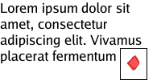

# golang-wrapper

This is a library to provide positional and rendering word wrapping of text any arbitrary rectangle. 
It is capable of giving you the positions of each individual word, as well as rendering it to an image if desired.


To


It is technically capable of handling rich text and non-text objects; adding them can be done manually as a library user.

Part of the goal of the library was to:
* Provide just positioning details without drawing
* Be as simple as necessary
* Be usable with the `image` package and not provide too much of a framework
* Support rich text eventually
* Support arbitrary locations provided as a `image.Rectangle` or `image.Image`

# Concept

## Box


The basics of the library is that it first breaks up the line in to "boxes" boxes can essentially be anything however
in the 'simple' implementation here they are assumed to be a set of characters, spaces, or a control character (essentially
a new line) A box can be thought of the lowest level representation that the library is willing to dea with.

This is created by a `boxer` a standard iterator like component:
```go
type Boxer interface {
    Next() (Box, int, error)
    SetFontDrawer(face *font.Drawer)
    FontDrawer() *font.Drawer
    Back(i int)
}
```

For simple uses of the wrapping library you shouldn't need to worry about this. But you might care if you want to insert
your box, which can be done provided it implements the: `Box` interface. But basically a box interface tells the size of 
the object, the baseline, and a mechanism for drawing it.


The baseline is probably the most important part, it is the "line" which the character is positioned. If you were to mix
multiple font sizes you would want a consistent baseline so they all appear on the same level:


## Line

A line is just that a line of boxes that fit in the given space (provided in a rect). A line is produced by a `Liner`. 
Such as a simple liner. Line does the real folding work; in the 'simple' version it calls the boxer (subject to change) 
for the next element. Then stops when it runs out of space. If it ends on a space it will return a new line character instead.


## Simple

Simple basically is the first iteration which is simple enough to be used. I have used it as I intend to add versions which 
work differently. Simple makes many assumptions such as language assumptions.

## Wrap

Wrap is just a container object for ease of use.

# Usage

How do I use this to draw text in the simplest possible way?

```go
    i := image.NewRGBA(image.Rect(0, 0, *width, *height))
    gr, err := OpenFont(*fontname)
    if err != nil {
        log.Panicf("Error opening font %s: %s", *fontname, err)
    }
    grf := GetFontFace(*fontsize, *dpi, gr)
    text, err := GetText(*textsource)
    if err != nil {
        log.Panicf("Text fetch error: %s", err)
    }
    if err := wordwrap.SimpleWrapTextToImage(text, i, grf, options); err != nil {
        log.Panicf("Text wrap and draw error: %s", err)
    }
```

Note:
* OpenFont - left to an exercise for the user
* GetFontFace - left to an exercise for the user
* GetText - left to an exercise for the user

You could also do it in 2 steps, this provides the rectangles incase you wanted to make a word clickable.

```go
    i := image.NewRGBA(image.Rect(0, 0, *width, *height))
    gr, err := OpenFont(*fontname)
    if err != nil {
        log.Panicf("Error opening font %s: %s", *fontname, err)
    }
    grf := GetFontFace(*fontsize, *dpi, gr)
    text, err := GetText(*textsource)
    if err != nil {
        log.Panicf("Text fetch error: %s", err)
    }
    target := image.Rect(350,44,592, 209)
    sw, lines, _, err := wordwrap.SimpleWrapTextToRect(text, target, grf)
    if err != nil {
    log.Panicf("Text wrap error: %s", err)
    }
    if err := sw.RenderLines(i, lines, target.Min); err != nil {
    log.Panicf("Text draw error: %s", err)
    }
```

## Options

There will be more options but some are:

### WordWrap/Line Option: `wordwrap.BoxLine`

Using the option `BoxLine` will cause the image to draw a box around the lines of boxes. Like such


Usage:
```go
wordwrap.SimpleWrapTextToImage(text, i, grf, wordwrap.BoxLine)
```

### WordWrap/Box Option: `wordwrap.BoxBox`

Using the option `BoxLine` will cause the image to draw a box around the boxes. Like such


Usage:
```go
wordwrap.SimpleWrapTextToImage(text, i, grf, wordwrap.BoxBox)
```

### `wordwrap.NewPageBreakBox`

Adds a box that will be put at the end of every "page" of the
word wrap. For instance a "more text" option used in:
https://github.com/arran4/golang-rpg-textbox


Usage:
```go
wordwrap.SimpleWrapTextToImage(text, i, grf, wordwrap.NewPageBreakBox(NewImageBox(image)))
```

### `wordwrap.ImageBoxMetricAboveTheLine` (default)

Puts the image above the line as you would expect on a modern word processor


Usage:
```go
wordwrap.SimpleWrapTextToImage(text, i, grf, wordwrap.NewPageBreakBox(wordwrap.NewImageBox(chevronImage, wordwrap.ImageBoxMetricAboveTheLine), wordwrap.BoxBox))
```

### `wordwrap.ImageBoxMetricBelowTheLine` (default)

Puts the image below the line as you would expect on a modern word processor



Usage:
```go
wordwrap.SimpleWrapTextToImage(text, i, grf, wordwrap.NewPageBreakBox(wordwrap.NewImageBox(chevronImage, wordwrap.ImageBoxMetricBelowTheLine), wordwrap.BoxBox))
```

### `wordwrap.ImageBoxMetricCenterLine`

Vertically centers the box line


Usage:
```go
wordwrap.SimpleWrapTextToImage(text, i, grf, wordwrap.NewPageBreakBox(wordwrap.NewImageBox(chevronImage, wordwrap.ImageBoxMetricCenter(fontDrawer)), wordwrap.BoxBox))
```

### `wordwrap.SourceImageMapper`

This allows you to substitute the source image for a box. Such as the source image for text is a color.Uniform image, so
it allows you to change the color, or apply some other effect such as a pattern or fade it out. 

For an image you can use proxy / interceptor pattern draw.Image structure to modify the source image as you want.

### `wordwrap.BoxDrawMap`

Is a function to the form:
```go
func(box Box, drawOps *DrawConfig, bps *BoxPositionStats) Box
```

Which is executed just before each box is drawn if provided. This allows you to substitute a box, such as with an empty
box if you don't wish for it to be drawn, or you could use it to mask input.


### Positioning functions: `wordwrap.HorizontalCenterLines` `wordwrap.RightLines` `wordwrap.HorizontalCenterBlock` `wordwrap.RightBlock` `wordwrap.VerticalCenterBlock` `wordwrap.BottomBlock`

Vertical or horizontally justifies or positions the lines or block, as per below.

Block is the entire block of text, while the line is just each line individually.

| Option                           | Result                   | Usage                                                                              |
|----------------------------------|--------------------------|------------------------------------------------------------------------------------|
| `wordwrap.HorizontalCenterLines` |  | ```wordwrap.SimpleWrapTextToImage(text, i, grf, wordwrap.HorizontalCenterLines)``` | 
| `wordwrap.RightLines`            |  | ```wordwrap.SimpleWrapTextToImage(text, i, grf, wordwrap.RightLines)```            | 
| `wordwrap.HorizontalCenterBlock` |  | ```wordwrap.SimpleWrapTextToImage(text, i, grf, wordwrap.HorizontalCenterBlock)``` | 
| `wordwrap.RightBlock`            |  | ```wordwrap.SimpleWrapTextToImage(text, i, grf, wordwrap.RightBlock)```            | 
| `wordwrap.VerticalCenterBlock`   |  | ```wordwrap.SimpleWrapTextToImage(text, i, grf, wordwrap.VerticalCenterBlock)```   | 
| `wordwrap.BottomBlock`           |  | ```wordwrap.SimpleWrapTextToImage(text, i, grf, wordwrap.BottomBlock)```           | 

## CLI app

For demo purposes there is a CLI app in `cmd/simplewraptoimage`

```
  -boxbox
    	Box the box
  -boxline
    	Box the line
  -dpi float
    	Doc dpi (default 180)
  -font string
    	Text font (default "goregular")
  -height int
    	Doc height (default 600)
  -out string
    	file to write to, in some cases this is ignored (default "out.png")
  -size float
    	font size (default 16)
  -text string
    	File in, or - for std input (default "-")
  -width int
    	Doc width (default 400)
```

Only font that is supported is "goregular" as this is only a demo. Happy to accept PRs to expand the `util` package to 
make it more general. (Or to include more cli.)

The contents of the `images` directory are outputs from this using the test data from the folder `testdata`

# Advanced Layout System

The library now supports a flexible, 2-pass (or 3-pass) layout system via the `TextToSpecs` method on `SimpleWrapper`. This allows for complex constraints like "A4 Width", "Minimum Width but Unbounded Height", or "Auto-sizing with a Max Width".

## Core Concepts

*   **TextToSpecs**: The main entry point. It calculates the layout without rendering, returning a `LayoutResult`.
*   **SpecOption**: Functional options to define constraints (`Width`, `Height`, `Padding`, `PageBackground`).
*   **SizeFunction**: Functions that determine size based on content measurements (`Fixed`, `Auto`/`Unbounded`, `Min`, `Max`, `A4Width`, etc).

## Examples

### Simple Fixed Width

Constrain the text to a fixed width of 200px.

```go
func ExampleSimpleWrapper_TextToSpecs_simple() {
	// Standard Wrapper Args
	args := []interface{}{
		font,
		"Simple Text wrapping example.",
	}
	
	// Create Wrapper
	wrapper := wordwrap.NewRichWrapper(args...)
	
	// Layout with Constraint: Fixed Width 200px
	result, err := wrapper.TextToSpecs(wordwrap.Width(wordwrap.Fixed(200)))
	if err != nil {
		log.Fatal(err)
	}

	// Render
	img := image.NewRGBA(image.Rect(0, 0, result.PageSize.X, result.PageSize.Y))
	if err := wrapper.RenderLines(img, result.Lines, result.ContentStart); err != nil {
		log.Fatal(err)
	}
	
	saveDocImage("simple_example.png", img)
}
```


### A4 Document Layout

Create a standard A4 document layout (at 96 DPI) with padding and a white background.

```go
func ExampleSimpleWrapper_TextToSpecs_a4() {
	// ... load font ...
	text := "This is an example of an A4 document layout..."

	wrapper := wordwrap.NewRichWrapper(font, text)

	// Layout Specs: A4 Width (96 DPI), 20px Padding, White Background
	result, err := wrapper.TextToSpecs(
		wordwrap.Width(wordwrap.A4Width(96)),
		wordwrap.Padding(20, color.Black),
		wordwrap.PageBackground(color.White),
	)
	if err != nil {
		log.Fatal(err)
	}

	img := image.NewRGBA(image.Rect(0, 0, result.PageSize.X, result.PageSize.Y))
	
	// Draw Background
	if result.PageBackground != nil {
		draw.Draw(img, img.Bounds(), &image.Uniform{result.PageBackground}, image.Point{}, draw.Src)
	}

	if err := wrapper.RenderLines(img, result.Lines, result.ContentStart); err != nil {
		log.Fatal(err)
	}
	// ...
}
```


### A4 Document Layout (Full Page)

Create a standard A4 document layout with both fixed width and height. Note that `A4Width` and `A4Height` require the target DPI (e.g., 96) to calculate the correct pixel dimensions.

```go
func ExampleSimpleWrapper_TextToSpecs_a4_full() {
	// ... load font ...
	text := "This is an example of a full A4 document layout..."

	wrapper := wordwrap.NewRichWrapper(font, text)

	// Layout Specs: A4 Width & Height (96 DPI), 20px Padding, White Background
	result, err := wrapper.TextToSpecs(
		wordwrap.Width(wordwrap.A4Width(96)),
		wordwrap.Height(wordwrap.A4Height(96)),
		wordwrap.Padding(20, color.Black),
		wordwrap.PageBackground(color.White),
	)
	if err != nil {
		log.Fatal(err)
	}

	// ... Render same as included in the examples ...
	// saveDocImage("a4_full_example.png", img)
}
```


### Flexible Constraints (Min/Max/Auto)

Use `Min` and `Max` to create flexible layouts. For example, `Min(A4, Unbounded)` effectively means "Auto width, but capped at A4 width" (logic: `min(A4, natural)`).

```go
func ExampleSimpleWrapper_TextToSpecs_flexible() {
	// ...
	wrapper := wordwrap.NewRichWrapper(font, "This text will wrap at A4 width...")

	result, err := wrapper.TextToSpecs(
		wordwrap.Width(wordwrap.Min(wordwrap.A4Width(96), wordwrap.Unbounded())),
		wordwrap.PageBackground(color.White),
	)
	// ...
}
```


## Rich Text Support

The library supports rich text including colors, fonts, inline images, backgrounds, and text effects (underline, strikethrough, highlight). These are composed using `NewRichWrapper` and functional options.

### Comprehensive Example

```go
func Example_richTextComprehensive() {
	// ... Setup resources (fonts, images) ...

	args := []interface{}{
		fontRegular,
		"Standard text. ",
		
		// Text Color
		wordwrap.TextColor(color.RGBA{0, 0, 255, 255}), 
		"Blue Text. ",
		wordwrap.TextColor(color.Black), // Reset
		
		// Background Color (Highlight)
		wordwrap.BgColor(color.RGBA{255, 255, 0, 255}),
		"Yellow Background. ",
		
		// Scoped Styles using Group
		wordwrap.Group{
			Args: []interface{}{
				wordwrap.TextColor(color.RGBA{0, 100, 0, 255}),
				"Scoped Green Text. ",
				wordwrap.BgColor(color.RGBA{220, 255, 220, 255}),
				"Green on Light Green. ",
			},
		},
		"Back to Normal. ",
		"\n\n",

		// Font Size Changes
		fontLarge, "Large Text. ",
		fontRegular, "Normal Text. ",
		"\n\n",

		// Effects: Underline, Strikethrough
		"Text with ",
		wordwrap.Group{
			Args: []interface{}{
				wordwrap.Underline(color.RGBA{255, 0, 0, 255}),
				"Red Underline",
			},
		},
		" and ",
		wordwrap.Group{
			Args: []interface{}{
				wordwrap.Strikethrough(color.Black),
				"Strikethrough",
			},
		},
		".\n\n",

		// Inline Images and Alignment
		"Image aligned baseline: ",
		wordwrap.ImageContent{Image: redBox},
		" Text after.",
		"\n",
		"Image aligned Top: ",
		wordwrap.Group{
			Args: []interface{}{
				wordwrap.Alignment(wordwrap.AlignTop),
				wordwrap.ImageContent{Image: redBox},
			},
		},
		" (Text Top).",
		"\n",
		
		// Background Image Pattern
		wordwrap.Group{
			Args: []interface{}{
				wordwrap.BgImage(pattern),
				"Text on Pattern Background. ",
				fontLarge, "Even Large Text on Pattern.",
			},
		},
	}

	wrapper := wordwrap.NewRichWrapper(args...)
	// ... Layout and Render ...
	saveDocImage("richtext_comprehensive.png", img)
}
```


# License

Licensed under the Apache License, Version 2.0 (the "License");
you may not use this file except in compliance with the License.
You may obtain a copy of the License at

    http://www.apache.org/licenses/LICENSE-2.0

Unless required by applicable law or agreed to in writing, software
distributed under the License is distributed on an "AS IS" BASIS,
WITHOUT WARRANTIES OR CONDITIONS OF ANY KIND, either express or implied.
See the License for the specific language governing permissions and
limitations under the License.
